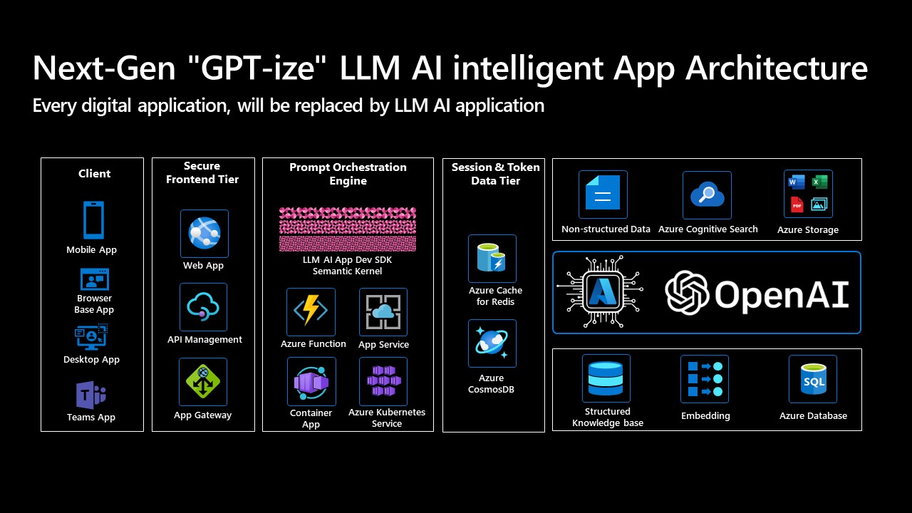

# Azure OpenAI App Innovation Workshop 

## 下一代GPT-化智能應用架構 - 一個快速工程和RAG方法與LLM AI Dev框架
在大型語言模型應用領域中，提示工程的重要性逐漸變得顯而易見。提示工程是一種基於人類語言直覺的技術，可以幫助初創企業、公司和企業在構建大型語言模型時快速實現特定功能。基於自然語言問題的正式表示，提示工程可以有效地指導大型語言模型的學習過程，從而提高其性能。一些論文顯示，在某些複雜的推理和思考鏈路上，提示甚至表現比微調更好。

檢索增強生成（RAG）是一種方法，可以大大提高GPT回答問題的準確性。它將預先訓練的模型與向量化的數據存儲相結合，允許在文本生成過程中直接檢索和操作外部知識。RAG可以幫助GPT模型更好地理解和利用給定的知識，從而提高其在知識密集型任務中的性能。在實際應用中，RAG方法可以顯著提高模型輸出的精度，有效防止模型幻覺和虛構。

基於這些研究發現，我們提出了一個面向企業級下一代GPT智能應用工程的框架，該框架基於檢索增強生成和提示工程方法。如下圖所示，該框架使開發人員可以快速構建自己的大型智能應用，而無需修改模型本身，並立即享受新一代人工智能為任何商業場景帶來的生產力紅利。

 

如圖所示，該架構利用靈活的語義計算引擎作為提示引擎，支持各種部署形式，例如PaaS、無伺服器和容器，使開發人員可以根據實時業務需求優化提示引擎並彈性擴展計算資源。基於Redis和CosmosDB的會話和令牌數據服務層為應用程序添加了上下文緩存、會話持久性、提示持久性等能力，為基於提示的模型或引擎優化留下了空間。前端的API封裝、負載均衡和網關進一步增強了應用的安全性和可靠性，使智能實體可以以更安全、更穩定的方式與各種前端應用集成。最重要的是，該架構基於Azure Cognitive Search和向量嵌入兩種附加的私有知識庫技術設計了雙引擎架構。一方面，Azure Cognitive Search可以快速索引PDF和WORD文件等非結構化數據，使現有數據可以立即使用。另一方面，通過利用帶有向量存儲和處理功能的Azure數據庫，並將其與Azure OpenAI的嵌入向量生成模型結合，企業現有的結構化知識庫可以輕松集成，從而從尖端GPT模型中產生更準確、更穩定、更可靠的結果。

## 語義內核 - LLM AI Dev框架/SDK

語義內核（SK）是一個輕量級的SDK，可以將AI大型語言模型（LLM）與傳統編程語言集成。SK可擴展的編程模型結合了自然語言語義功能、傳統代碼本地功能和基於嵌入的記憶體解鎖，為應用程序添加了AI的新潛力和價值。

SK支持提示模板化、功能鏈接、向量化記憶體和智能規劃能力。

 

語義內核旨在支持和封裝最新的人工智能研究中的多種設計模式，開發人員可以將複雜的技能，如提示鏈接、遞歸推理、摘要、零/少樣本學習、上下文記憶、長期記憶、嵌入、語義索引、規劃和訪問外部知識庫以及您自己的數據，融入到他們的應用程序中。

如需更多信息，請訪問 [語義內核項目](https://github.com/microsoft/semantic-kernel)

## Azure GPT App Innovation Workshop 

This is an app innovation workshop focused on exploring the use of Azure PaaS and OpenAI GPT model to build modern large language modelintelligent applications. Workshop aims to provide practical skills and experience in developing innovative intelligent applications on Azure for IT and architecture decision-makers, business decision-makers, and developers.

In this workshop, attendees will learn how to select Azure workloads to design a modern GPT intelligent application, understand Azure OpenAI services, explore the capabilities of large model prompt engineering, understand common parameters and options in the OpenAI API, and land an next generation GPT intelligent application architecture inside their organization through hands-on experimentation.

Whether you are a novice or an experienced professional, this workshop will meet the expectations and needs of participants. Attendees will be able to interact with experts, share experiences, and gain inspiration and insights from real project cases. Together, we will explore exciting GPT intelligent applications and usher in a new era of intelligent applications!

- Workshop content [Chinese](./Workshop%20Content%20CHS/)
- Workshop content [English](./Workshop%20Content%20EN/)
- [Demo notebook](./Demo%20Notebook/)
- [Source code](./Source%20Code/)
- [Hands on lab manual](./Hands%20on%20lab%20manual/)

### Product Documents

- [Azure Openai](https://learn.microsoft.com/zh-cn/azure/cognitive-services/openai/)
- [Azure Cognitive Search](https://learn.microsoft.com/zh-cn/azure/search/)
- [Azure App Service](https://learn.microsoft.com/zh-cn/azure/app-service/)
- [Azure API Management](https://learn.microsoft.com/zh-cn/azure/api-management/)
- [Azure Container App](https://learn.microsoft.com/zh-cn/azure/container-apps/)
- [Azure Kubernetes Service](https://learn.microsoft.com/zh-cn/azure/aks/)
- [Azure CosmosDB](https://learn.microsoft.com/zh-cn/azure/cosmos-db/)
- [Azure Cache for Redis](https://learn.microsoft.com/zh-cn/azure/azure-cache-for-redis/)
- [Azure Azure Database for PostgreSQL](https://learn.microsoft.com/zh-cn/azure/postgresql/)
- [Qdrant Vector Database on Azure Cloud](https://github.com/Azure-Samples/qdrant-azure)

### Relevant Repositories
- [Knowledge Mining with OpenAI Architecture](https://github.com/MSUSAzureAccelerators/Knowledge-Mining-with-OpenAI)
- [ChatGPT + Enterprise data with Azure OpenAI and Cognitive Search](https://github.com/Azure-Samples/azure-search-openai-demo)
- [Azure OpenAI Samples](https://github.com/Azure/azure-openai-samples)
- [Experimental: Uncle John's Semantic Kernel Recipes](https://github.com/johnmaeda/SK-Recipes)
- [Hackathon Materials for Semantic Kernel](https://learn.microsoft.com/en-us/semantic-kernel/support/hackathon)
- [Durable Task Framework](https://github.com/microsoft/durabletask-go/tree/dapr)
- [Learn Azure OpenAI Service with .NET](https://github.com/kinfey/dotNETOAIBooks)
- [Project Miyagi - Financial coach](https://github.com/appdevgbb/miyagi)
- [reddog-solutions](https://github.com/Azure/reddog-solutions)
- [Awesome ChatGPT Prompts](https://github.com/f/awesome-chatgpt-prompts/)

### Reference
- [Retrieval-Augmented Generation for Knowledge-Intensive NLP Tasks](https://arxiv.org/abs/2005.11401)
- [Chain-of-Thought Prompting Elicits Reasoning in Large Language Models. arXiv, 2022](https://arxiv.org/abs/2201.11903)
- [Emergent Analogical Reasoning in Large Language Models. arXiv:2212.09196, 2022](https://arxiv.org/abs/2212.09196)
- [Generated Knowledge Prompting for Commonsense Reasoning. arXiv:2110.08387, 2022](https://arxiv.org/abs/2110.08387)
- [Multitask Prompted Training Enables Zero-Shot Task Generalization. arXiv:2110.08207, 2022](https://arxiv.org/abs/2110.08207)
- [Prompt Programming for Large Language Models: Beyond the Few-Shot Paradigm. arXiv:2102.07350, 2021](https://arxiv.org/abs/2102.07350)
- [Self-Consistency Improves Chain of Thought Reasoning in Language Models. arXiv:2203.11171, 2022](https://arxiv.org/abs/2203.11171)
- [How does GPT Obtain its Ability? Tracing Emergent Abilities of Language Models to their Sources](https://yaofu.notion.site/How-does-GPT-Obtain-its-Ability-Tracing-Emergent-Abilities-of-Language-Models-to-their-Sources-b9a57ac0fcf74f30a1ab9e3e36fa1dc1#a83aa8c34a254289ace924fa83e0b9c9)
- [A Closer Look at Large Language Models Emergent Abilities](https://yaofu.notion.site/A-Closer-Look-at-Large-Language-Models-Emergent-Abilities-493876b55df5479d80686f68a1abd72f)
- [Illustrating Reinforcement Learning from Human Feedback (RLHF)](https://huggingface.co/blog/rlhf)
- [Best practices for prompt engineering with openai api](https://help.openai.com/en/articles/6654000-best-practices-for-prompt-engineering-with-openai-api)

### Further research and exploration
- [Sparks of Artificial General Intelligence: Early experiments with GPT-4](https://arxiv.org/abs/2303.12712)
- [HuggingGPT: Solving AI Tasks with ChatGPT and its Friends in HuggingFace](https://arxiv.org/abs/2303.17580)
- [Automatic Generation of Grammar-Agnostic Visualizations and Infographics](https://microsoft.github.io/lida/)
